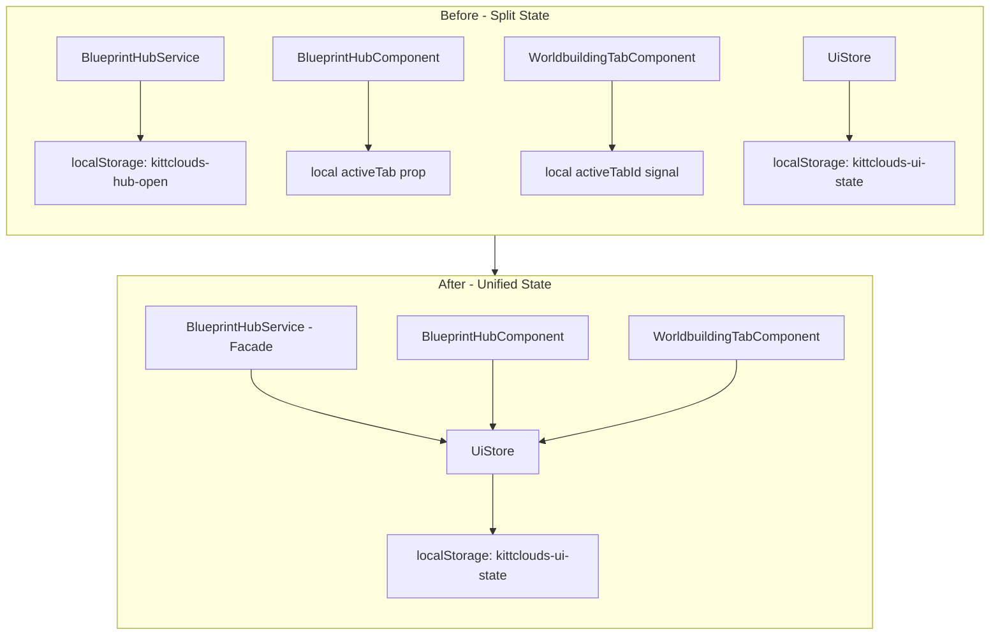

# Blueprint Hub NgRx Migration Plan

## Executive Summary

Migrate Blueprint Hub state management from split local state to centralized NgRx SignalStore. This resolves the "split brain" state issue where [`BlueprintHubService`](src/app/components/blueprint-hub/blueprint-hub.service.ts) maintains its own localStorage-persisted signal while [`UiStore`](src/app/lib/ngrx/ui.store.ts) already has the same capability.

## Current State Analysis

### State Locations (Problem)

```
┌─────────────────────────────────────────────────────────────────┐
│                     CURRENT STATE (Split Brain)                 │
├─────────────────────────────────────────────────────────────────┤
│                                                                 │
│  UiStore (NgRx)                  BlueprintHubService (Local)    │
│  ├─ blueprintHubOpen ◄─────────► ├─ isHubOpen (signal)         │
│  ├─ activeHubTab                 └─ localStorage key A         │
│  └─ localStorage key B                                          │
│                                                                 │
│  BlueprintHubComponent           WorldbuildingTabComponent      │
│  └─ activeTab (local prop)       └─ activeTabId (local signal) │
│                                                                 │
│  Result: 4 separate state locations, 2 localStorage keys        │
└─────────────────────────────────────────────────────────────────┘
```

### Target State (Solution)

```
┌─────────────────────────────────────────────────────────────────┐
│                     TARGET STATE (Unified)                      │
├─────────────────────────────────────────────────────────────────┤
│                                                                 │
│  UiStore (NgRx SignalStore)                                     │
│  ├─ blueprintHubOpen: boolean                                   │
│  ├─ activeHubTab: string                                        │
│  ├─ worldbuildingActiveTab: WorldBuildingTabId                  │
│  └─ withStorageSync → single localStorage key                   │
│                                                                 │
│  BlueprintHubService (Facade)                                   │
│  └─ Wraps UiStore for backward compatibility                    │
│                                                                 │
│  Result: 1 state location, 1 localStorage key                   │
└─────────────────────────────────────────────────────────────────┘
```

## Implementation Steps

### Step 1: Update UiStore with Worldbuilding State

**File:** [`src/app/lib/ngrx/ui.store.ts`](src/app/lib/ngrx/ui.store.ts)

#### 1a. Add WorldbuildingTabId Type Import

```typescript
// Add to TYPES section
export type WorldbuildingTabId = 'overview' | 'geography' | 'culture' | 'magic' | 'religion' | 'politics' | 'mystery';
```

#### 1b. Extend UiState Interface

```typescript
export interface UiState {
    // ... existing properties ...
    
    /** Active sub-tab in Worldbuilding tab */
    worldbuildingActiveTab: WorldbuildingTabId;
}
```

#### 1c. Update Initial State

```typescript
const initialState: UiState = {
    leftSidebarOpen: true,
    leftSidebarView: 'notes',
    rightSidebarOpen: true,
    rightSidebarView: 'entity',
    blueprintHubOpen: false,
    activeHubTab: 'graph',  // CHANGED: was 'entities', now matches component default
    footerExpanded: false,
    worldbuildingActiveTab: 'overview',  // NEW
};
```

#### 1d. Add setWorldbuildingTab Method

```typescript
// Add to withMethods section
setWorldbuildingTab(tab: WorldbuildingTabId): void {
    patchState(store, { worldbuildingActiveTab: tab });
    (store as any)._persistToStorage();
},
```

---

### Step 2: Refactor BlueprintHubService as UiStore Facade

**File:** [`src/app/components/blueprint-hub/blueprint-hub.service.ts`](src/app/components/blueprint-hub/blueprint-hub.service.ts)

The service becomes a thin facade to maintain backward compatibility with any components already injecting it.

```typescript
import { Injectable } from '@angular/core';
import { UiStore } from '../../lib/ngrx';

/**
 * Facade over UiStore for Blueprint Hub state.
 * @deprecated Prefer injecting UiStore directly for new code.
 */
@Injectable({ providedIn: 'root' })
export class BlueprintHubService {
    constructor(private uiStore: UiStore) {}

    /** Whether the hub is currently open */
    get isHubOpen() {
        return this.uiStore.blueprintHubOpen;
    }

    /** Toggle hub open/closed */
    toggle(): void {
        if (this.uiStore.blueprintHubOpen()) {
            this.uiStore.closeBlueprintHub();
        } else {
            this.uiStore.openBlueprintHub();
        }
    }

    /** Close the hub */
    close(): void {
        this.uiStore.closeBlueprintHub();
    }

    /** Open the hub */
    open(): void {
        this.uiStore.openBlueprintHub();
    }
}
```

**Key Changes:**
- Remove local `signal` and `effect`
- Remove `PLATFORM_ID` injection (SSR handled by UiStore)
- Remove `HUB_STORAGE_KEY` (handled by UiStore's `withStorageSync`)
- All methods delegate to UiStore

---

### Step 3: Refactor BlueprintHubComponent

**File:** [`src/app/components/blueprint-hub/blueprint-hub.component.ts`](src/app/components/blueprint-hub/blueprint-hub.component.ts)

#### 3a. Add UiStore Injection

```typescript
import { UiStore } from '../../lib/ngrx';

constructor(
    public hubService: BlueprintHubService,
    private uiStore: UiStore
) {}
```

#### 3b. Convert activeTab to Computed

```typescript
import { computed } from '@angular/core';

// Replace: activeTab = 'graph';
activeTab = computed(() => this.uiStore.activeHubTab());
```

#### 3c. Update setActiveTab

```typescript
setActiveTab(tabId: string) {
    this.uiStore.setHubTab(tabId);
}
```

#### 3d. Update Template (if needed)

The template already uses `activeTab`, so no changes needed since we're keeping the same property name (now a signal instead of a string).

---

### Step 4: Refactor WorldbuildingTabComponent

**File:** [`src/app/components/blueprint-hub/tabs/worldbuilding-tab/worldbuilding-tab.component.ts`](src/app/components/blueprint-hub/tabs/worldbuilding-tab/worldbuilding-tab.component.ts)

#### 4a. Add UiStore Injection

```typescript
import { UiStore } from '../../../../lib/ngrx';

export class WorldbuildingTabComponent implements OnInit {
    constructor(private uiStore: UiStore) {}
```

#### 4b. Convert activeTabId to Computed

```typescript
import { computed } from '@angular/core';

// Replace: activeTabId = signal<WorldBuildingTabId>('overview');
activeTabId = computed(() => this.uiStore.worldbuildingActiveTab());
```

#### 4c. Update setActiveTab

```typescript
setActiveTab(id: WorldBuildingTabId) {
    this.uiStore.setWorldbuildingTab(id);
}
```

---

## Verification Checklist

### Build Verification
- [ ] `ng build` completes with no errors
- [ ] No TypeScript strict mode violations
- [ ] No unused variable warnings

### Functional Verification
- [ ] Hub opens/closes correctly
- [ ] Hub state persists across page reload
- [ ] Main tab switching works (Graph, Theme, Patterns, etc.)
- [ ] Active main tab persists across page reload
- [ ] Worldbuilding sub-tab switching works
- [ ] Worldbuilding sub-tab persists across page reload
- [ ] Graph tab still renders correctly

### Regression Verification
- [ ] Other components using BlueprintHubService still work
- [ ] No console errors related to state management

---

## Migration Diagram



---

## Risk Assessment

| Risk | Likelihood | Impact | Mitigation |
|------|------------|--------|------------|
| Breaking changes in components using BlueprintHubService | Low | Medium | Service maintains same public API |
| localStorage key conflict during migration | Low | Low | UiStore key already exists; new fields merge cleanly |
| Template binding issues | Low | Low | Keeping same property names (signals vs values) |

---

## Files Modified

1. [`src/app/lib/ngrx/ui.store.ts`](src/app/lib/ngrx/ui.store.ts) - Add worldbuildingActiveTab state
2. [`src/app/components/blueprint-hub/blueprint-hub.service.ts`](src/app/components/blueprint-hub/blueprint-hub.service.ts) - Facade pattern
3. [`src/app/components/blueprint-hub/blueprint-hub.component.ts`](src/app/components/blueprint-hub/blueprint-hub.component.ts) - Use UiStore
4. [`src/app/components/blueprint-hub/tabs/worldbuilding-tab/worldbuilding-tab.component.ts`](src/app/components/blueprint-hub/tabs/worldbuilding-tab/worldbuilding-tab.component.ts) - Use UiStore
