# Data River Redirect: GoSQLite ↔ OPFS Direct Architecture

## Executive Summary

**Current Flow:** `UI → GoSQLite → SyncQueue → CozoDB → OPFS`
**Proposed Flow:** `UI → GoSQLite ↔ OPFS` (CozoDB hydrates from OPFS for graph queries only)

GoSQLite becomes the **sole source of truth**. OPFS becomes the **sole durable cold store**. CozoDB becomes a **read-only graph engine** that hydrates on demand. The SyncQueue dies.

---

## Architecture Audit Notes

> These are the findings from auditing the original plan against the actual codebase.

### 🔴 Critical Finding: SQLite Export/Import

The original plan proposed `sqlStore.Export()` and `sqlStore.Import()` methods. These **do not exist** on `SQLiteStore` and can't trivially be added because:

- `ncruces/go-sqlite3` wraps its DB behind `database/sql` — there's no direct file handle
- The DSN is `:memory:` — there's no `.db` file on disk to read
- **Solution:** Use the `sqlite3` C API backup interface exposed by `ncruces/go-sqlite3` to serialize the in-memory DB to `[]byte` and deserialize back. Alternatively, use `VACUUM INTO` to dump to a temp path in the hackpadfs IDB, then read those bytes.

### 🟡 Important: Worker Context Constraint

`FileSystemSyncAccessHandle` (sync OPFS access) **only works in Web Workers**. The Go WASM currently runs on the main thread (no dedicated worker). This means:

- Go cannot directly call `FileSystemSyncAccessHandle`
- **Solution:** The OPFS sync bridge lives in TypeScript (either the existing GoKitt worker context or a dedicated OPFS worker). Go exports a `storeExport` / `storeImport` WASM function. TypeScript calls `storeExport()` → gets bytes → writes to OPFS via worker. On boot, TypeScript reads OPFS → calls `storeImport()`.

### 🟡 Important: Folder Schema Gap

`GoSQLite` has no `folders` table. The current bridge explicitly says "Folders are NOT in GoSQLite currently (schema limitation)". Options:

- **Option A:** Add a `folders` table to GoSQLite schema → full parity
- **Option B:** Keep folders in CozoDB only (acceptable since folders are metadata, not content)
- **Decision:** Option A for Phase 1 (add the table). Full source of truth means full schema.

### 🟢 Validated: IndexedDB as Cache

The existing `hackpadfs/indexeddb` is already used by the vector store (`initVectors` in `main.go`). We can reuse this pattern for SQLite DB file caching. The Go WASM already knows how to read/write bytes to IDB via hackpadfs.

---

## Current Architecture (Before)


### Key Files (Actual)

| File | Role | Lines |
|------|------|-------|
| `GoSqliteCozoBridge.ts` | Orchestrates GoSQLite ↔ CozoDB sync via SyncQueue | 548 |
| `SyncQueue.ts` | Batch/debounce queue for CozoDB writes | 238 |
| `sqlite_store.go` | In-memory SQLite with temporal versioning | 842 |
| `models.go` | Go struct definitions (Note, Entity, Edge, Storer interface) | 98 |
| `main.go` | WASM exports — `storeInit`, `storeUpsertNote`, etc. | 1492 |
| `RealOpfsBackend.ts` | OPFS file operations (write, read, exists, delete, move) | 77 |
| `CozoPersistenceService.ts` | CozoDB snapshot + WAL persistence to OPFS via worker | 200 |

---

## Proposed Architecture (After)

```mermaid
flowchart TD
    UI[UI Components] --> GoSQLite[GoSQLite - Source of Truth ⚡]
    
    GoSQLite -->|storeExport bytes| SyncBridge[GoOpfsSyncService.ts]
    SyncBridge -->|write bytes| OPFS[OPFS - Cold Storage 💾]
    OPFS -->|read bytes on boot| SyncBridge
    SyncBridge -->|storeImport bytes| GoSQLite
    
    SyncBridge -->|hackpadfs write| IDB[IndexedDB - Boot Cache 🚀]
    IDB -->|hackpadfs read on boot| GoSQLite
    
    OPFS -->|Lazy hydrate on demand| CozoHydrator[CozoHydrator.ts]
    CozoHydrator --> CozoDB[CozoDB - Graph Engine 🕸️ Read-Only]
    
    subgraph "Separation of Concerns"
        S1["GoSQLite: CRUD + Versioning + Fast Reads"]
        S2["OPFS: Durable binary persistence"]
        S3["IDB: Fast boot cache (hackpadfs)"]
        S4["CozoDB: Datalog graph queries ONLY"]
    end
```



### Storage Layer Hierarchy

| Layer | Technology | Role | Persistence | Speed |
|-------|------------|------|-------------|-------|
| **Hot** | GoSQLite (`:memory:`) | Source of truth, all CRUD | Volatile | ~1ms |
| **Warm** | IndexedDB (hackpadfs) | Fast boot cache | Durable | ~10ms |
| **Cold** | OPFS (`FileSystemSyncAccessHandle`) | Ground truth durability | Durable | ~50ms |
| **Graph** | CozoDB (in-memory) | Datalog/graph queries | Volatile | ~5ms query |

### Data Flow: Write Path

```
User edits note
  → goKittStore.upsertNote()         // GoSQLite immediate write (~1ms)
  → syncService.markDirty()          // Signal debounced sync
  → [debounce 3s]
  → goKittStore.export()             // Serialize SQLite to bytes
  → opfsSyncWorker.writeSync(bytes)  // Write to OPFS via worker
  → idbCache.write(bytes)            // Update IDB cache in parallel
```

### Data Flow: Read Path (Boot)

```
App starts
  → Try IDB cache (hackpadfs)        // Fast: ~50ms
    → If hit: goKittStore.import(bytes) → Ready!
    → Background: compare checksum against OPFS
  → If miss: read from OPFS           // Slower: ~300ms
    → goKittStore.import(bytes) → Ready!
  → If both empty: Fresh start         // No data yet
```

### Data Flow: Graph Query

```
User opens graph view
  → cozoHydrator.ensureHydrated()     // Check if CozoDB needs data
    → If stale: read OPFS → parse → bulk import to CozoDB
  → cozoDb.runQuery(datalogScript)    // Pure graph query
```

---

## Implementation Plan

### Phase 1: GoSQLite Export/Import + Folders Schema (Go Side)

> **Goal:** GoSQLite can serialize itself to bytes and restore from bytes. Folders table added.

#### Task 1.1: Add `folders` table to SQLite schema

```go
// GoKitt/internal/store/sqlite_store.go — add to schema const

-- Folders
CREATE TABLE IF NOT EXISTS folders (
    id TEXT PRIMARY KEY,
    name TEXT NOT NULL,
    parent_id TEXT,
    world_id TEXT NOT NULL,
    narrative_id TEXT,
    folder_order REAL DEFAULT 0,
    created_at INTEGER NOT NULL,
    updated_at INTEGER NOT NULL
);

CREATE INDEX IF NOT EXISTS idx_folders_parent ON folders(parent_id);
CREATE INDEX IF NOT EXISTS idx_folders_world ON folders(world_id);
```

**Add to `models.go`:**
```go
type Folder struct {
    ID          string  `json:"id"`
    Name        string  `json:"name"`
    ParentID    string  `json:"parentId,omitempty"`
    WorldID     string  `json:"worldId"`
    NarrativeID string  `json:"narrativeId,omitempty"`
    FolderOrder float64 `json:"folderOrder"`
    CreatedAt   int64   `json:"createdAt"`
    UpdatedAt   int64   `json:"updatedAt"`
}
```

**Add to `Storer` interface:**
```go
// Folders
UpsertFolder(folder *Folder) error
GetFolder(id string) (*Folder, error)
DeleteFolder(id string) error
ListFolders(parentID string) ([]*Folder, error)
```

**Acceptance:** `go test ./internal/store/... -run TestFolderCRUD` passes.

#### Task 1.2: Add `Export()` / `Import()` to `SQLiteStore`

The `ncruces/go-sqlite3` library provides access to the underlying SQLite connection. We need the [backup API](https://www.sqlite.org/backup.html) to serialize `:memory:` to bytes.

```go
// GoKitt/internal/store/export.go

package store

import (
    "fmt"
    
    "github.com/ncruces/go-sqlite3"
    "github.com/ncruces/go-sqlite3/driver"
)

// Export serializes the entire in-memory database to a byte slice.
// Uses SQLite backup API: memory → temp file → read bytes.
func (s *SQLiteStore) Export() ([]byte, error) {
    s.mu.RLock()
    defer s.mu.RUnlock()

    // Get the underlying *sqlite3.Conn from database/sql
    conn, err := s.getConn()
    if err != nil {
        return nil, fmt.Errorf("export: get conn: %w", err)
    }

    // Use sqlite3.Conn.BackupInit to serialize
    // Serialize the in-memory database
    data := conn.Serialize("main")
    if data == nil {
        return []byte{}, nil // Empty database
    }
    
    return data, nil
}

// Import restores the database from a byte slice.
// Replaces all existing data.
func (s *SQLiteStore) Import(data []byte) error {
    s.mu.Lock()
    defer s.mu.Unlock()

    if len(data) == 0 {
        return nil // Nothing to import
    }

    conn, err := s.getConn()
    if err != nil {
        return fmt.Errorf("import: get conn: %w", err)
    }

    // Deserialize into the in-memory database  
    if err := conn.Deserialize("main", data); err != nil {
        return fmt.Errorf("import: deserialize: %w", err)
    }

    return nil
}

// getConn extracts the underlying sqlite3.Conn from database/sql.
// This uses the driver-specific connection interface.
func (s *SQLiteStore) getConn() (*sqlite3.Conn, error) {
    // ncruces/go-sqlite3/driver exposes the raw connection
    // via driver.Conn interface
    rawConn, err := s.db.Conn(context.Background())
    if err != nil {
        return nil, err
    }
    
    var sqliteConn *sqlite3.Conn
    err = rawConn.Raw(func(driverConn interface{}) error {
        if c, ok := driverConn.(interface{ Raw() *sqlite3.Conn }); ok {
            sqliteConn = c.Raw()
            return nil
        }
        return fmt.Errorf("driver connection doesn't expose Raw()")
    })
    
    return sqliteConn, err
}
```

> ⚠️ **Audit Note:** The exact API for `Serialize`/`Deserialize` needs verification against `ncruces/go-sqlite3` docs. If not available, fallback is: open a temp DB in hackpadfs, use `VACUUM INTO`, read the file bytes.

**Acceptance:** `go test ./internal/store/... -run TestExportImport` passes — roundtrip creates data, exports, imports into new store, verifies data.

#### Task 1.3: Register WASM exports

```go
// Add to main.go register block:
"storeExport":       js.FuncOf(storeExport),
"storeImport":       js.FuncOf(storeImport),
"storeUpsertFolder": js.FuncOf(storeUpsertFolder),
"storeGetFolder":    js.FuncOf(storeGetFolder),
"storeDeleteFolder": js.FuncOf(storeDeleteFolder),
"storeListFolders":  js.FuncOf(storeListFolders),
```

```go
// storeExport serializes the SQLite database to a Uint8Array.
// Args: [] 
// Returns: base64-encoded string of database bytes
func storeExport(this js.Value, args []js.Value) interface{} {
    if sqlStore == nil {
        return errorResult("store not initialized")
    }
    
    data, err := sqlStore.Export()
    if err != nil {
        return errorResult("export failed: " + err.Error())
    }

    // Create a Uint8Array in JS and copy data
    jsArray := js.Global().Get("Uint8Array").New(len(data))
    js.CopyBytesToJS(jsArray, data)
    
    result := map[string]interface{}{
        "data": jsArray,
        "size": len(data),
    }
    jsonBytes, _ := json.Marshal(map[string]interface{}{
        "success": true,
        "size":    len(data),
    })
    // Return the Uint8Array directly for zero-copy
    return jsArray
}

// storeImport restores the SQLite database from a Uint8Array.
// Args: [data Uint8Array]
func storeImport(this js.Value, args []js.Value) interface{} {
    if len(args) < 1 {
        return errorResult("storeImport requires 1 arg: data (Uint8Array)")
    }
    if sqlStore == nil {
        return errorResult("store not initialized")
    }

    jsArray := args[0]
    length := jsArray.Get("length").Int()
    data := make([]byte, length)
    js.CopyBytesToGo(data, jsArray)

    if err := sqlStore.Import(data); err != nil {
        return errorResult("import failed: " + err.Error())
    }

    return successResult(fmt.Sprintf("imported %d bytes", length))
}
```

**Acceptance:** From browser console: `GoKitt.storeExport()` returns a `Uint8Array`. `GoKitt.storeImport(bytes)` restores state.

---

### Phase 2: OPFS Sync Bridge (TypeScript Side)

> **Goal:** TypeScript service that syncs GoSQLite bytes to/from OPFS, with IDB caching.

#### Task 2.1: Create `GoOpfsSyncService.ts`

```typescript
// src/app/lib/opfs/GoOpfsSyncService.ts

import { Injectable, inject, signal } from '@angular/core';
import { GoKittStoreService } from '../../services/gokitt-store.service';
import { RealOpfsBackend } from './RealOpfsBackend';

export type SyncStatus = 'idle' | 'syncing' | 'error';

const OPFS_DB_PATH = 'gokitt/sqlite.db';
const OPFS_CHECKSUM_PATH = 'gokitt/sqlite.checksum';
const SYNC_DEBOUNCE_MS = 3000; // 3 seconds after last write
const SYNC_MAX_WAIT_MS = 10000; // Force sync after 10s of continuous activity

@Injectable({ providedIn: 'root' })
export class GoOpfsSyncService {
    private goKittStore = inject(GoKittStoreService);
    private opfs = new RealOpfsBackend();
    
    private _status = signal<SyncStatus>('idle');
    private _lastSync = signal<number>(0);
    private _dirty = signal(false);
    
    readonly status = this._status.asReadonly();
    readonly lastSync = this._lastSync.asReadonly();
    readonly isDirty = this._dirty.asReadonly();
    
    private debounceTimer: ReturnType<typeof setTimeout> | null = null;
    private maxWaitTimer: ReturnType<typeof setTimeout> | null = null;

    /**
     * Boot sequence: Load SQLite state from fastest available source.
     * 
     * Priority:
     * 1. IDB cache (hackpadfs) — handled by GoKitt storeInit internally
     * 2. OPFS cold storage — if IDB empty or stale
     * 3. Fresh start — if nothing exists
     */
    async boot(): Promise<'idb' | 'opfs' | 'fresh'> {
        // Step 1: GoKitt storeInit already loads from IDB via hackpadfs
        // Check if store has data after init
        const noteCount = await this.goKittStore.countNotes();
        
        if (noteCount > 0) {
            // IDB cache hit — verify against OPFS in background
            this.backgroundVerify();
            return 'idb';
        }
        
        // Step 2: Try OPFS
        const opfsData = await this.opfs.read(OPFS_DB_PATH);
        if (opfsData && opfsData.length > 0) {
            await this.goKittStore.importDatabase(opfsData);
            return 'opfs';
        }
        
        // Step 3: Fresh start
        return 'fresh';
    }

    /**
     * Mark the database as dirty (needs sync to OPFS).
     * Called after any write operation.
     */
    markDirty(): void {
        this._dirty.set(true);
        this.scheduleSync();
    }

    /**
     * Force an immediate sync to OPFS.
     */
    async syncNow(): Promise<void> {
        this.clearTimers();
        await this.performSync();
    }

    /**
     * Sync the SQLite database to OPFS.
     */
    private async performSync(): Promise<void> {
        if (!this._dirty()) return;
        
        this._status.set('syncing');
        
        try {
            // Export SQLite bytes from Go WASM
            const bytes = await this.goKittStore.exportDatabase();
            
            if (!bytes || bytes.length === 0) {
                console.warn('[GoOpfsSync] Export returned empty data');
                return;
            }
            
            // Write to OPFS
            await this.opfs.write(OPFS_DB_PATH, bytes);
            
            // Write checksum for verification
            const checksum = `${bytes.length}-${Date.now()}`;
            const checksumBytes = new TextEncoder().encode(checksum);
            await this.opfs.write(OPFS_CHECKSUM_PATH, checksumBytes);
            
            this._dirty.set(false);
            this._lastSync.set(Date.now());
            this._status.set('idle');
            
            console.log(`[GoOpfsSync] ✅ Synced ${bytes.length} bytes to OPFS`);
        } catch (err) {
            console.error('[GoOpfsSync] ❌ Sync failed:', err);
            this._status.set('error');
            // Retry on next schedule
            this.scheduleSync();
        }
    }

    private scheduleSync(): void {
        // Debounce: reset on each call
        if (this.debounceTimer) clearTimeout(this.debounceTimer);
        this.debounceTimer = setTimeout(() => this.performSync(), SYNC_DEBOUNCE_MS);
        
        // Max wait: ensure we sync even during continuous activity
        if (!this.maxWaitTimer) {
            this.maxWaitTimer = setTimeout(() => {
                this.maxWaitTimer = null;
                this.performSync();
            }, SYNC_MAX_WAIT_MS);
        }
    }

    private clearTimers(): void {
        if (this.debounceTimer) { clearTimeout(this.debounceTimer); this.debounceTimer = null; }
        if (this.maxWaitTimer) { clearTimeout(this.maxWaitTimer); this.maxWaitTimer = null; }
    }

    /**
     * Background verification: compare IDB state against OPFS.
     */
    private async backgroundVerify(): Promise<void> {
        try {
            const opfsExists = await this.opfs.exists(OPFS_DB_PATH);
            if (!opfsExists) {
                // IDB has data but OPFS doesn't — sync to OPFS immediately
                console.log('[GoOpfsSync] 🔄 IDB has data, OPFS empty — syncing...');
                this._dirty.set(true);
                await this.performSync();
            }
            // If both have data, IDB takes precedence (it's the cache of what was running)
        } catch (err) {
            console.warn('[GoOpfsSync] Background verify failed:', err);
        }
    }

    /**
     * Cleanup on service destroy.
     */
    destroy(): void {
        this.clearTimers();
        // Force final sync if dirty
        if (this._dirty()) {
            this.performSync(); // Fire and forget
        }
    }
}
```

**Acceptance:** Service boots, exports bytes from GoSQLite, writes to OPFS, reads back on next boot.

#### Task 2.2: Extend `GoKittStoreService` with export/import

Add `exportDatabase()` and `importDatabase()` methods that call the new WASM functions:

```typescript
// In gokitt-store.service.ts

async exportDatabase(): Promise<Uint8Array> {
    const result = this.callWasm('storeExport');
    if (result instanceof Uint8Array) return result;
    throw new Error('Export returned non-Uint8Array');
}

async importDatabase(data: Uint8Array): Promise<void> {
    const result = this.callWasm('storeImport', data);
    // Parse result for error
}

async countNotes(): Promise<number> {
    const notes = await this.listNotes();
    return notes.length;
}
```

**Acceptance:** `goKittStore.exportDatabase()` returns bytes. `goKittStore.importDatabase(bytes)` restores.

---

### Phase 3: CozoHydrator (CozoDB as Read-Only Graph Engine)

> **Goal:** CozoDB hydrates from OPFS SQLite bytes on demand. Never writes to OPFS.

#### Task 3.1: Create `CozoHydrator.ts`

```typescript
// src/app/lib/bridge/CozoHydrator.ts

import { Injectable, inject, signal } from '@angular/core';
import { GoKittStoreService, StoreNote, StoreEntity, StoreEdge } from '../../services/gokitt-store.service';
import { cozoDb } from '../cozo/db';
import { DexieToCozo, CozoQueries } from './CozoFieldMapper';

export type HydrationStatus = 'empty' | 'hydrating' | 'ready' | 'stale' | 'error';

@Injectable({ providedIn: 'root' })
export class CozoHydrator {
    private goKittStore = inject(GoKittStoreService);
    
    private _status = signal<HydrationStatus>('empty');
    private _lastHydration = signal<number>(0);
    private hydrationVersion = 0;
    
    readonly status = this._status.asReadonly();
    readonly isReady = () => this._status() === 'ready';
    
    /**
     * Ensure CozoDB is hydrated before a graph query.
     * Call this as a guard before any Datalog query.
     */
    async ensureHydrated(): Promise<void> {
        if (this._status() === 'ready') return;
        if (this._status() === 'hydrating') {
            // Wait for in-progress hydration
            await this.waitForHydration();
            return;
        }
        await this.hydrate();
    }

    /**
     * Invalidate CozoDB state (call after OPFS sync completes).
     * Next graph query will trigger re-hydration.
     */
    invalidate(): void {
        this._status.set('stale');
    }

    /**
     * Full hydration from GoSQLite → CozoDB.
     * Reads all data from GoSQLite and bulk-imports into CozoDB relations.
     */
    async hydrate(): Promise<void> {
        this._status.set('hydrating');
        const version = ++this.hydrationVersion;
        const start = Date.now();
        
        try {
            // 1. Read all data from GoSQLite
            const [notes, entities, edges] = await Promise.all([
                this.goKittStore.listNotes(),
                this.goKittStore.listEntities(),
                this.goKittStore.listEdgesAll(), // Need to add this method
            ]);
            
            // 2. Check if we were superseded
            if (version !== this.hydrationVersion) return;
            
            // 3. Bulk import into CozoDB
            // Notes
            for (const note of notes) {
                const dexieNote = GoKittStoreService.toDexieNote(note);
                const cozoNote = DexieToCozo.note(dexieNote);
                cozoDb.runMutation(CozoQueries.upsertNote(cozoNote));
            }
            
            // Entities  
            for (const entity of entities) {
                const dexieEntity = GoKittStoreService.toDexieEntity(entity);
                const cozoEntity = DexieToCozo.entity(dexieEntity);
                cozoDb.runMutation(CozoQueries.upsertEntity(cozoEntity));
            }
            
            // Edges
            for (const edge of edges) {
                const dexieEdge = GoKittStoreService.toDexieEdge(edge);
                const cozoEdge = DexieToCozo.edge(dexieEdge);
                cozoDb.runMutation(CozoQueries.upsertEdge(cozoEdge));
            }
            
            this._status.set('ready');
            this._lastHydration.set(Date.now());
            console.log(`[CozoHydrator] ✅ Hydrated in ${Date.now() - start}ms: ${notes.length} notes, ${entities.length} entities, ${edges.length} edges`);
            
        } catch (err) {
            console.error('[CozoHydrator] ❌ Hydration failed:', err);
            this._status.set('error');
        }
    }

    /**
     * Direct Datalog query with auto-hydration guard.
     */
    async query<T = unknown[]>(script: string, params?: Record<string, unknown>): Promise<T[]> {
        await this.ensureHydrated();
        const result = cozoDb.runQuery(script, params || {});
        if (!result.ok) {
            console.error('[CozoHydrator] Query failed:', result.message || result.display);
            return [];
        }
        return result.rows || [];
    }

    private waitForHydration(): Promise<void> {
        return new Promise((resolve) => {
            const check = setInterval(() => {
                if (this._status() !== 'hydrating') {
                    clearInterval(check);
                    resolve();
                }
            }, 50);
        });
    }
}
```

**Acceptance:** `CozoHydrator.query()` returns graph data without any prior manual hydration.

---

### Phase 4: Rewire the Bridge

> **Goal:** `GoSqliteCozoBridge` is simplified. SyncQueue is removed. All writes go through GoSQLite only. OPFS sync is triggered by `GoOpfsSyncService`. CozoDB hydration is lazy.

#### Task 4.1: Simplify `GoSqliteCozoBridge`

The bridge becomes a thin facade:

```typescript
@Injectable({ providedIn: 'root' })
export class GoSqliteCozoBridge {
    private goKittStore = inject(GoKittStoreService);
    private opfsSync = inject(GoOpfsSyncService);
    private hydrator = inject(CozoHydrator);
    
    // No more SyncQueue!
    // No more processQueuedOps!
    // No more backgroundSyncVerify!
    
    async init(): Promise<void> {
        // 1. Boot from fastest source
        const bootSource = await this.opfsSync.boot();
        console.log(`[Bridge] Booted from: ${bootSource}`);
        
        // 2. CozoDB hydration happens lazily on first graph query
        this._status.set('ready');
    }
    
    // === Write Operations (GoSQLite only) ===
    
    async syncNote(note: Note): Promise<void> {
        await this.goKittStore.upsertNote(GoKittStoreService.fromDexieNote(note));
        this.opfsSync.markDirty();
        this.hydrator.invalidate(); // Stale CozoDB
    }
    
    async syncFolder(folder: Folder): Promise<void> {
        await this.goKittStore.upsertFolder(GoKittStoreService.fromDexieFolder(folder));
        this.opfsSync.markDirty();
    }
    
    async syncEntity(entity: Entity): Promise<void> {
        await this.goKittStore.upsertEntity(GoKittStoreService.fromDexieEntity(entity));
        this.opfsSync.markDirty();
        this.hydrator.invalidate();
    }
    
    async syncEdge(edge: Edge): Promise<void> {
        await this.goKittStore.upsertEdge(GoKittStoreService.fromDexieEdge(edge));
        this.opfsSync.markDirty();
        this.hydrator.invalidate();
    }
    
    // === Delete Operations ===
    
    async deleteNote(id: string): Promise<void> {
        await this.goKittStore.deleteNote(id);
        this.opfsSync.markDirty();
        this.hydrator.invalidate();
    }
    
    // ... same pattern for deleteFolder, deleteEntity, deleteEdge
    
    // === Graph Queries (CozoDB via Hydrator) ===
    
    async queryGraph<T = unknown[]>(script: string, params?: Record<string, unknown>): Promise<T[]> {
        return this.hydrator.query<T>(script, params);
    }
    
    // === Read Operations (GoSQLite direct — fast!) ===
    // These remain unchanged from current implementation
}
```

#### Task 4.2: Delete `SyncQueue.ts` and `SyncQueue.test.ts`

These files are no longer needed. The debounced sync is now handled by `GoOpfsSyncService` at the binary level (whole-database sync), not per-operation.

#### Task 4.3: Remove `CozoPersistenceService` usage for data persistence

The `CozoPersistenceService` (snapshot + WAL to OPFS) is no longer the persistence path. It can be:
- **Kept** for CozoDB's own internal state (HNSW indices, computed properties)
- **Or removed** entirely if CozoDB is fully ephemeral

**Decision:** Keep it temporarily for backward compatibility during dual-write validation, remove in Phase 5.

---

### Phase 5: Cleanup & Migration

> **Goal:** Remove all dead code. Ensure clean upgrade path for existing users.

#### Task 5.1: Migration strategy for existing OPFS data

Existing users have CozoDB snapshots + WAL in OPFS. On first boot with the new system:

1. Check if `gokitt/sqlite.db` exists in OPFS (new format)
2. If not, check if CozoDB OPFS data exists (old format)
3. If old format: hydrate GoSQLite from CozoDB snap → export to new OPFS path → done
4. Delete old CozoDB OPFS data after successful migration

```typescript
async migrateIfNeeded(): Promise<boolean> {
    const newExists = await this.opfs.exists('gokitt/sqlite.db');
    if (newExists) return false; // Already migrated
    
    const oldExists = await this.opfs.exists('cozo/snapshot.bin');
    if (!oldExists) return false; // Nothing to migrate
    
    console.log('[Migration] Migrating from CozoDB OPFS to GoSQLite OPFS...');
    // Load CozoDB snapshot → hydrate GoSQLite → export to new path
    // ... migration logic
    return true;
}
```

#### Task 5.2: Remove dead code

- [ ] Delete `SyncQueue.ts` and `SyncQueue.test.ts`
- [ ] Remove SyncQueue import from `GoSqliteCozoBridge.ts`
- [ ] Remove `CozoPersistenceService.ts` (or reduce to CozoDB-internal use)
- [ ] Remove `cozo-opfs.worker.ts` (if CozoDB persistence fully removed)
- [ ] Clean up `GoSqliteCozoBridge` comments referencing old flow
- [ ] Update `index.ts` barrel exports

---

## Edge Cases and Failure Modes

### 1. OPFS Quota Exceeded

**Detection:**
```typescript
const quota = await navigator.storage.estimate();
const usagePercent = (quota.usage! / quota.quota!) * 100;
if (usagePercent > 90) {
    // Warn user, prune old note versions
}
```

**Mitigation:**
- GoSQLite temporal versioning allows `DELETE FROM notes WHERE is_current = 0 AND updated_at < ?` to prune history
- Alert user when approaching quota
- Export database to file download as backup

### 2. Multi-Tab Conflict

**Problem:** Two tabs both have GoSQLite in memory, both writing to the same OPFS file.

**Mitigation:**
```typescript
// Use BroadcastChannel for tab coordination
const channel = new BroadcastChannel('gokitt-sync');

// Before writing to OPFS:
channel.postMessage({ type: 'sync-start', tabId: myTabId });

// Listen for conflicts:
channel.onmessage = (e) => {
    if (e.data.type === 'sync-start' && e.data.tabId !== myTabId) {
        // Another tab is syncing — skip our sync, re-read after they're done
        this.skipNextSync = true;
    }
};
```

**Long-term:** Use `navigator.locks.request('gokitt-opfs-write', ...)` for proper locking.

### 3. Browser Crash / Worker Kill

**Mitigation:**
- `beforeunload` fires → force sync to OPFS
- Frequent debounced syncs (every 3-10s of activity)
- IDB cache is always close to current state (hackpadfs writes on every Go DB mutation)
- On recovery: compare IDB timestamp vs OPFS timestamp, use newer

### 4. CozoDB Hydration Failure

**Mitigation:**
- CozoDB is **non-critical** for basic CRUD operations
- App functions fully without graph features
- Show degraded mode indicator in UI
- Retry hydration on next graph query request

### 5. SQLite Export OOM

**Problem:** Very large databases might OOM during `Export()` (serializing entire DB to memory).

**Mitigation:**
- Monitor database size: `SELECT page_count * page_size FROM pragma_page_count(), pragma_page_size()`
- For databases > 50MB: implement chunked export
- Prune note history aggressively

---

## Decisions Made

| Question | Decision | Rationale |
|----------|----------|-----------|
| Sync frequency | Debounced 3s, max 10s | Balance between durability and performance |
| Conflict resolution | Last-write-wins + tab coordination | Simplest correct solution for single-user app |
| CozoDB lifecycle | Ephemeral, lazy hydrate, destroy on idle | Saves memory when graph features unused |
| Backward compatibility | Auto-migrate CozoDB OPFS → GoSQLite OPFS | Zero user action required |
| Folders | Add to GoSQLite schema | Full source-of-truth parity |

---

## Performance Expectations

| Metric | Current | Expected | Improvement |
|--------|---------|----------|-------------|
| Write latency (user-perceived) | ~50ms (GoSQLite + SyncQueue + CozoDB) | ~1ms (GoSQLite only) | **50x faster** |
| OPFS persistence latency | ~50ms per CozoDB relation mutation | ~100ms per 3s batch (whole DB) | **Eliminated from hot path** |
| Boot time (IDB cached) | ~200ms (GoSQLite) + ~500ms (CozoDB load) | ~50ms (GoSQLite from hackpadfs) | **4x faster** |
| Boot time (cold, OPFS) | ~800ms (CozoDB snapshot + WAL replay) | ~300ms (SQLite binary import) | **2.7x faster** |
| Memory usage | High (CozoDB + GoSQLite both hold all data) | Medium (GoSQLite only, CozoDB lazy) | **~40% reduction** |
| Graph query (first) | Fast (already loaded) | ~200ms (hydration penalty) | Slightly slower first time |
| Graph query (subsequent) | Fast | Fast (CozoDB hot) | No change |

---

## Implementation Checklist

### Go WASM (Phase 1) ✅
- [x] Add `folders` table to schema (`sqlite_store.go`)
- [x] Add `Folder` model and CRUD methods (`models.go`, `sqlite_store.go`)
- [x] Implement `Export()` / `Import()` on `SQLiteStore` via `Serialize`/`Deserialize`
- [x] Register `storeExport`, `storeImport`, folder WASM exports (`main.go`)
- [ ] Unit tests for all new methods (`store_test.go`)
- [ ] Rebuild WASM binary

### TypeScript (Phase 2-4) ✅
- [x] Create `GoOpfsSyncService.ts` with boot/sync/verify
- [x] Extend `GoKittStoreService` with `exportDatabase()` / `importDatabase()` / folder CRUD
- [x] Extend `gokitt.worker.ts` with export/import/folder message handlers
- [x] Create `CozoHydrator.ts` with lazy hydration
- [x] Rewrite `GoSqliteCozoBridge.ts` — removed SyncQueue dependency, uses OPFS sync + CozoHydrator
- [x] Update barrel exports (`bridge/index.ts`)
- [ ] Wire `GoOpfsSyncService` into app bootstrap
- [ ] Update all consumers to use new bridge API

### Cleanup (Phase 5)
- [ ] Delete `SyncQueue.ts` + `SyncQueue.test.ts` (kept for backward compat for now)
- [ ] Migrate existing OPFS data on first boot
- [ ] Remove or reduce `CozoPersistenceService`
- [ ] Integration tests

---

## Next Steps

Phases 1-4 implemented. Remaining work:

1. **Rebuild WASM binary** with new Go code
2. **Wire GoOpfsSyncService** into app bootstrap (call `boot()` during init)
3. **Write Go unit tests** for Export/Import + Folders
4. **Phase 5 cleanup**: Migration, dead code removal, integration tests

