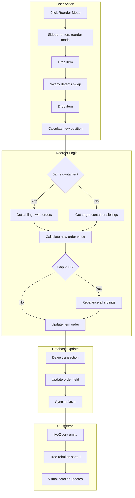

# Phase B: Drag-and-Drop Reordering Implementation Plan

## Overview
Implement drag-and-drop reordering for folders and notes in the sidebar file tree. Uses **Swapy** library with a **"Reorder Mode"** toggle. Supports both sibling reordering and cross-folder moves. Uses **float-based ordering** to minimize sibling updates during reordering.

## Architecture Decision

### Ordering Strategy: Float-Based (Lexicographic)
Given the narrative spine context (Act 1, 2, Chapter 1, 2, Scene 1, 2), float-based ordering is ideal:

```typescript
// Initial items get 1000, 2000, 3000...
// Inserting between 1000 and 2000 → 1500
// Inserting between 1000 and 1500 → 1250
// Rare edge case: rebalancing needed when gaps get too small
```

Benefits:
- Insert anywhere without reindexing siblings
- Reflects narrative sequence (higher number = later in story)
- Cross-folder moves only need to calculate new order value

### Swapy vs CDK
Swapy is chosen because:
- Already installed in the project
- Better integration with virtual scrollers
- Smaller bundle size for this specific use case
- Simple API: `data-swapy-slot` and `data-swapy-item` attributes

## Data Model Changes

### Updated Interfaces (src/app/lib/dexie/db.ts)

```typescript
export interface Note {
    id: string;
    worldId: string;
    title: string;
    content: string;
    markdownContent: string;
    folderId: string;
    entityKind: string;
    entitySubtype: string;
    isEntity: boolean;
    isPinned: boolean;
    favorite: boolean;
    ownerId: string;
    createdAt: number;
    updatedAt: number;
    narrativeId: string;
    order: number;  // NEW: Float-based ordering within folder
}

export interface Folder {
    id: string;
    worldId: string;
    name: string;
    parentId: string;
    entityKind: string;
    entitySubtype: string;
    entityLabel: string;
    color: string;
    isTypedRoot: boolean;
    isSubtypeRoot: boolean;
    collapsed: boolean;
    ownerId: string;
    createdAt: number;
    updatedAt: number;
    narrativeId: string;
    isNarrativeRoot: boolean;
    networkId?: string;
    metadata?: {
        date?: { year: number; monthIndex: number; dayIndex: number };
    };
    order: number;  // NEW: Float-based ordering within parent
}
```

### Database Version Update
Increment to version 4 with migration logic to populate `order` for existing items.

## Core Operations

### New Functions (src/app/lib/dexie/operations.ts)

```typescript
// Calculate order for inserting at specific position
function calculateOrder(siblings: Array<{order: number}>, insertIndex: number): number {
    const prev = siblings[insertIndex - 1]?.order ?? 0;
    const next = siblings[insertIndex]?.order ?? (prev + 2000);
    return (prev + next) / 2;
}

// Reorder siblings within same container
export async function reorderSiblings(
    containerId: string,
    itemId: string,
    newIndex: number,
    type: 'folder' | 'note'
): Promise<void> {
    // Get all siblings
    // Calculate new order value
    // Update moved item
    // Check if rebalancing needed (gap < 10)
}

// Move item to different container
export async function moveItem(
    itemId: string,
    targetContainerId: string,
    targetIndex: number,
    type: 'folder' | 'note'
): Promise<void> {
    // Transaction: update parentId/folderId + order
}

// Rebalance orders when gaps get too small
export async function rebalanceOrders(
    containerId: string,
    type: 'folder' | 'note'
): Promise<void> {
    // Reset all orders to 1000, 2000, 3000...
}
```

## Service Layer

### ReorderService (src/app/lib/services/reorder.service.ts)

Manages reorder mode state and Swapy integration:

```typescript
@Injectable({ providedIn: 'root' })
export class ReorderService {
    // State
    isReorderMode = signal(false);
    draggedItem = signal<FlatTreeNode | null>(null);
    dropTarget = signal<FlatTreeNode | null>(null);
    
    // Swapy instance
    private swapy: Swapy | null = null;
    
    // Enable/disable reorder mode
    enableReorderMode(container: HTMLElement): void {
        this.swapy = createSwapy(container, {
            animation: 'dynamic'
        });
        this.swapy.onSwap((event) => {
            this.handleSwap(event);
        });
    }
    
    disableReorderMode(): void {
        this.swapy?.destroy();
        this.swapy = null;
    }
    
    private async handleSwap(event: SwapEvent): Promise<void> {
        // Determine if same-container or cross-container
        // Call appropriate operation
    }
}
```

### Updated Queries

```typescript
// FolderService - get ordered children
getFolderChildren$(parentId: string): Observable<Folder[]> {
    return from(liveQuery(() =>
        db.folders
            .where('parentId').equals(parentId)
            .sortBy('order')  // NEW
    ));
}

// NotesService - get ordered notes in folder
getNotesByFolder$(folderId: string): Observable<Note[]> {
    return from(liveQuery(() =>
        db.notes
            .where('folderId').equals(folderId)
            .sortBy('order')  // NEW
    ));
}
```

## UI Components

### Sidebar Component Updates

Add "Reorder Mode" toggle button in toolbar:

```typescript
// State
isReorderMode = signal(false);

// Toggle handler
toggleReorderMode(): void {
    this.isReorderMode.update(v => !v);
    if (this.isReorderMode()) {
        // Collapse all to show flat reorderable list
        this.expansion.set(new Set());
    }
}
```

### FileTree Component Updates

When in reorder mode:
1. Show drag handles on each item
2. Disable normal click/select behavior
3. Initialize Swapy on the scroller content
4. Highlight drop zones

```typescript
// In reorder mode, render slots for Swapy
@ViewChild('scrollerContent') scrollerContent!: ElementRef;

ngAfterViewChecked() {
    if (this.isReorderMode() && !this.swapyInitialized) {
        this.initSwapy();
    }
}
```

### TreeNode Component Updates

Add drag handle visible only in reorder mode:

```html
<!-- Drag handle (reorder mode only) -->
<button *ngIf="isReorderMode" class="drag-handle">
    <lucide-icon [img]="GripVertical" size="14"></lucide-icon>
</button>
```

## Tree Building Updates

Update `buildTree` in sidebar.component.ts to sort by order:

```typescript
private buildTree(folders: DexieFolder[], notes: Note[]): TreeNode[] {
    // Sort folders by order
    const sortedFolders = [...folders].sort((a, b) => a.order - b.order);
    
    // Sort notes by order within each folder
    const sortedNotes = [...notes].sort((a, b) => a.order - b.order);
    
    // Build tree as before...
}
```

## Migration Strategy

When upgrading to DB version 4:

```typescript
this.version(4).upgrade(async (tx) => {
    // Populate order for existing folders
    const folders = await tx.table('folders').toArray();
    for (let i = 0; i < folders.length; i++) {
        const folder = folders[i];
        // Get siblings to determine order
        const siblings = await tx.table('folders')
            .where('parentId').equals(folder.parentId)
            .sortBy('createdAt');
        const index = siblings.findIndex(f => f.id === folder.id);
        await tx.table('folders').update(folder.id, { order: (index + 1) * 1000 });
    }
    
    // Same for notes...
});
```

## Workflow Diagram



## Edge Cases

1. **First item**: Order = 1000
2. **Last item**: Order = (last sibling order) + 1000
3. **Very small gap**: Trigger rebalance when gap < 10
4. **Cross-folder move**: Update both parentId and order in transaction
5. **Reorder mode with expansion**: Collapse all to prevent nested complexity

## Files to Modify

1. `src/app/lib/dexie/db.ts` - Add order field, update schema
2. `src/app/lib/dexie/operations.ts` - Add reorder functions
3. `src/app/lib/services/reorder.service.ts` - NEW: Reorder state management
4. `src/app/lib/services/folder.service.ts` - Update queries to sort by order
5. `src/app/lib/dexie/notes.service.ts` - Update queries to sort by order
6. `src/app/components/sidebar/sidebar.component.ts` - Add reorder mode toggle
7. `src/app/components/sidebar/file-tree/file-tree.component.ts` - Swapy integration
8. `src/app/components/sidebar/file-tree/tree-node.component.ts` - Drag handles

## Implementation Order

1. Database schema + migration
2. Operations layer (reorder functions)
3. Service layer (queries + ReorderService)
4. Sidebar UI (toggle button)
5. File-tree Swapy integration
6. Tree-node drag handles
7. Testing & refinement
