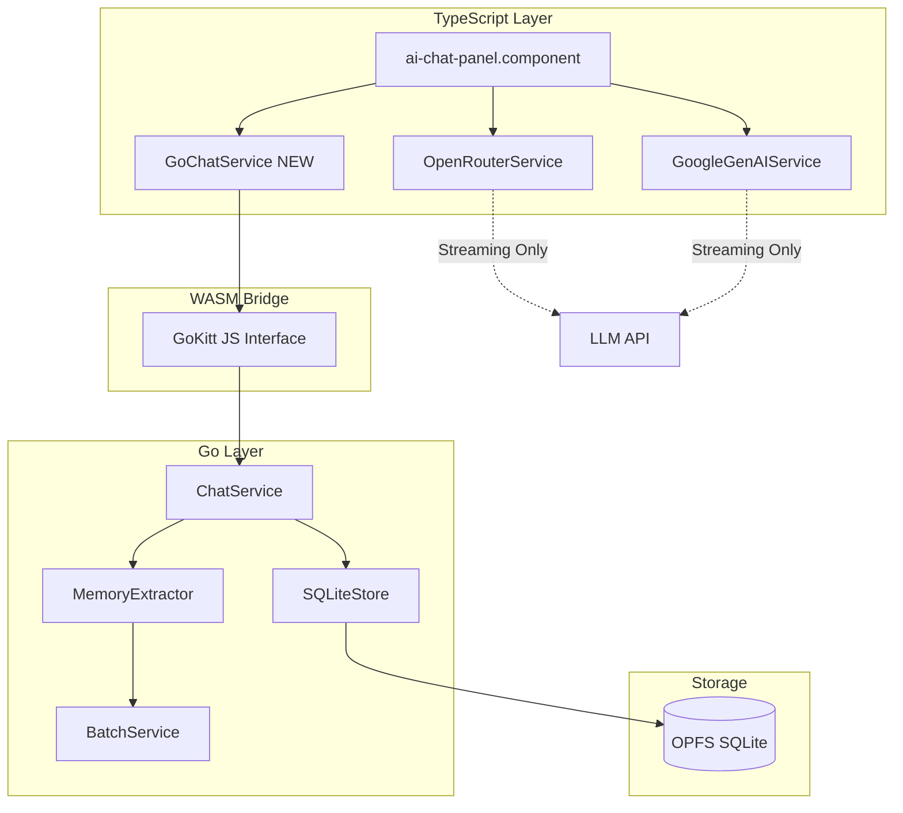
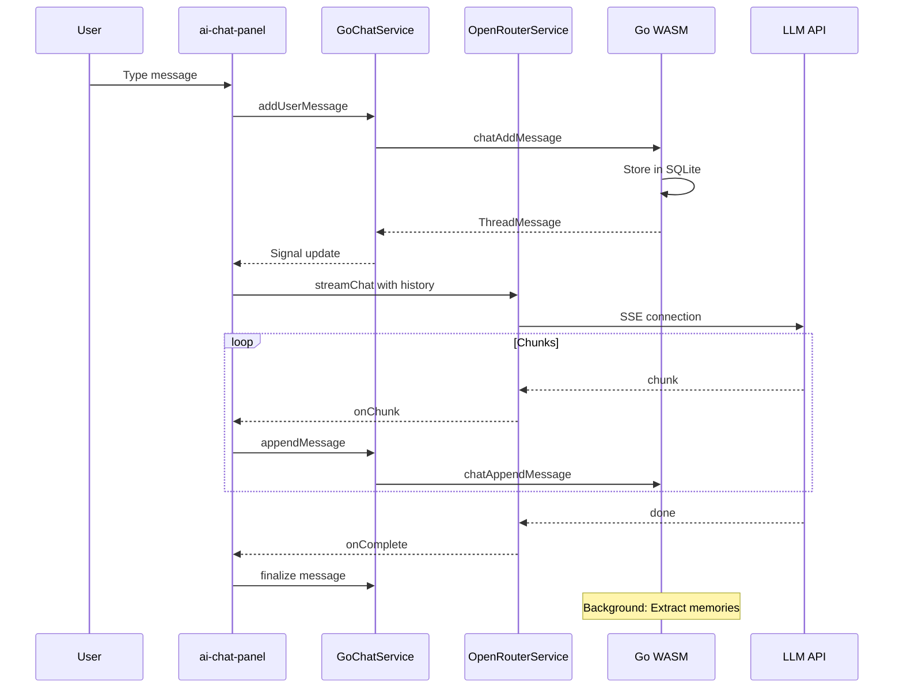

# Observational Memory — Completion Plan

## Executive Summary

Full codebase audit performed against [`observational-memory-status.md`](observational-memory-status.md). Phases 0–5 are genuinely complete. All Go code is substantive, well-structured, and passes `go build`.

---

## What's Done ✅

| Phase | Package | Lines | Status |
|-------|---------|-------|--------|
| 0 — Batch LLM | `pkg/batch/` (5 files) | ~600 | ✅ Google + OpenRouter, syscall/js fetch, wired in WASM |
| 1 — Data Layer | `internal/store/` (models + sqlite) | ~1900 | ✅ Schema + full CRUD for threads, messages, memories |
| 2 — LLM Integration | [`pkg/memory/openrouter.go`](../GoKitt/pkg/memory/openrouter.go) | 150 | ✅ Fixed: Uses syscall/js fetch (WASM-compatible) |
| 3 — Extractor | [`pkg/memory/extractor.go`](../GoKitt/pkg/memory/extractor.go) | 141 | ✅ ProcessMessage, GetContext, FormatContextForLLM |
| 4 — Chat Service | [`pkg/chat/service.go`](../GoKitt/pkg/chat/service.go) | 243 | ✅ Full thread/message CRUD + memory integration |
| 5 — WASM Bridge | [`cmd/wasm/main.go`](../GoKitt/cmd/wasm/main.go) | ~2000 | ✅ Complete: 14 new functions for chat/memory wired |

---

## What's Missing ❌

| Phase | Scope | Complexity |
|-------|-------|------------|
| 6 — TS Wrapper | Create `go-chat.service.ts` | Medium |
| 7 — UI Integration | Rewire [`ai-chat-panel.component.ts`](../src/app/components/right-sidebar/ai-chat-panel/ai-chat-panel.component.ts) | Medium |
| 8 — Cleanup | Remove old [`ai-chat.service.ts`](../src/app/lib/services/ai-chat.service.ts) + CozoDB chat tables | Low |

---

## Architecture Overview



---

## Phase 6: TypeScript Wrapper

### File: [`src/app/lib/services/go-chat.service.ts`](../src/app/lib/services/go-chat.service.ts) (NEW)

#### TypeScript Interfaces

```typescript
// Matching Go structs from GoKitt/internal/store/models.go

export interface Thread {
    id: string;
    world_id: string;
    narrative_id: string;
    title: string;
    created_at: number;
    updated_at: number;
}

export interface ThreadMessage {
    id: string;
    thread_id: string;
    role: 'user' | 'assistant' | 'system';
    content: string;
    narrative_id: string;
    created_at: number;
    updated_at: number;
    is_streaming: boolean;
}

export interface Memory {
    id: string;
    content: string;
    memory_type: 'fact' | 'preference' | 'entity_mention' | 'relation';
    confidence: number;
    source_role: string;
    entity_id: string;
    created_at: number;
    updated_at: number;
}
```

#### Service Structure

```typescript
@Injectable({ providedIn: 'root' })
export class GoChatService {
    // Reactive State
    readonly ready = signal(false);
    readonly currentThread = signal<Thread | null>(null);
    readonly messages = signal<ThreadMessage[]>([]);
    readonly threads = signal<Thread[]>([]);
    
    // Dependencies
    private goKittService = inject(GoKittService);
    
    // Core Methods
    async init(config: ChatConfig): Promise<void>
    async createThread(worldId?: string, narrativeId?: string): Promise<Thread>
    async loadThread(threadId: string): Promise<void>
    async addMessage(role: string, content: string): Promise<ThreadMessage>
    async getMessages(threadId: string): Promise<ThreadMessage[]>
    async updateMessage(messageId: string, content: string): Promise<void>
    async appendMessage(messageId: string, chunk: string): Promise<void>
    async getMemories(threadId: string): Promise<Memory[]>
    async getContext(threadId: string): Promise<string>
    async exportThread(threadId: string): Promise<string>
}
```

#### Key Implementation Details

1. **Initialization Flow:**
   - Read `openrouter:config` from Dexie via [`getSetting()`](../src/app/lib/dexie/settings.service.ts)
   - Call `GoKitt.chatInit(configJSON)` with API key + model
   - Set `ready` signal to true

2. **Thread Management:**
   - Use `worldId` from [`ScopeService.activeScope()`](../src/app/lib/services/scope.service.ts)
   - Auto-create thread on first message if none exists
   - Persist thread ID in Dexie settings for session continuity

3. **Message Flow:**
   - `addMessage()` → `GoKitt.chatAddMessage()`
   - `appendMessage()` → `GoKitt.chatAppendMessage()` (for streaming)
   - Update local signals after WASM success

---

## Phase 7: UI Integration

### Dual-Service Architecture

The UI uses **two services in tandem**:

| Service | Responsibility |
|---------|---------------|
| **GoChatService** | Persistence, memory extraction, thread management |
| **OpenRouterService / GoogleGenAIService** | Live LLM streaming (SSE) |

### Message Flow



### File Modifications: [`ai-chat-panel.component.ts`](../src/app/components/right-sidebar/ai-chat-panel/ai-chat-panel.component.ts)

#### Changes Required

1. **Inject GoChatService:**
   ```typescript
   goChatService = inject(GoChatService);  // NEW
   chatService = inject(AiChatService);     // KEEP for now, remove in Phase 8
   ```

2. **Initialization:**
   ```typescript
   async ngAfterViewInit(): Promise<void> {
       // Initialize Go chat service with OpenRouter config
       const orConfig = this.openRouter.config();
       if (orConfig?.apiKey) {
           await this.goChatService.init({
               apiKey: orConfig.apiKey,
               model: orConfig.model
           });
       }
       
       // Load or create thread
       await this.goChatService.loadOrCreateThread();
       
       // Continue with quikchat init...
   }
   ```

3. **Replace Message Calls:**
   ```typescript
   // OLD:
   await this.chatService.addUserMessage(text);
   
   // NEW:
   await this.goChatService.addMessage('user', text);
   ```

4. **Memory Context in Prompts:**
   ```typescript
   private async buildConversationHistory(currentMessage: string): Promise<OpenRouterMessage[]> {
       const messages: OpenRouterMessage[] = [];
       
       // Get memory context from Go
       const threadId = this.goChatService.currentThread()?.id;
       if (threadId) {
           const memoryContext = await this.goChatService.getContext(threadId);
           if (memoryContext) {
               messages.push({
                   role: 'system',
                   content: `Relevant context from memory:\n${memoryContext}`
               });
           }
       }
       
       // Add conversation history...
       return messages;
   }
   ```

5. **History Panel:**
   - Replace `chatService.getAllSessions()` with `goChatService.threads()`
   - Replace `chatService.switchSession()` with `goChatService.loadThread()`

---

## Phase 8: Cleanup

### Files to Delete

| File | Reason |
|------|--------|
| [`src/app/lib/services/ai-chat.service.ts`](../src/app/lib/services/ai-chat.service.ts) | Replaced by GoChatService |

### Schema Modifications

Remove CozoDB chat tables from [`layer4-memory.ts`](../src/app/lib/cozo/schema/layer4-memory.ts):

```typescript
// DELETE these relations:
// - chat_messages
// - chat_sessions (if exists)
```

### Dependency Verification

```bash
# Search for remaining references
grep -r "AiChatService" src/
grep -r "chat_messages" src/
grep -r "chat_sessions" src/
```

---

## Verification Plan

### Build Verification

```bash
# 1. Build WASM
cd GoKitt && go build ./cmd/wasm

# 2. Build Angular
ng build
```

### Functional Tests

| Test | Expected Result |
|------|-----------------|
| **Boot** | Console shows "Chat service initialized" |
| **Persist** | Send message, reload page → Message appears (loaded from Go SQLite) |
| **Memory** | Send "My favorite color is blue" → Check logs/DB for extracted memory |
| **Context** | Ask "What is my favorite color?" → LLM answers using RAG context from Go |
| **Export** | Click export → Valid JSON with thread history |

### Test Commands

```bash
# Check SQLite database contents (in browser console)
const goKitt = (window as any).GoKitt;
const threads = JSON.parse(goKitt.chatListThreads());
console.log('Threads:', threads);

const messages = JSON.parse(goKitt.chatGetMessages(threads[0].id));
console.log('Messages:', messages);

const memories = JSON.parse(goKitt.chatGetMemories(threads[0].id));
console.log('Memories:', memories);
```

---

## Risk Assessment

| Risk | Mitigation |
|------|------------|
| WASM not loaded before chat init | Add ready check with timeout |
| Memory extraction latency | Run async, don't block UI |
| OPFS quota exceeded | Add size monitoring + cleanup |
| Streaming desync | Use message IDs consistently |

---

## Implementation Order

1. **Phase 6** → Create [`go-chat.service.ts`](../src/app/lib/services/go-chat.service.ts)
2. **Phase 7** → Modify [`ai-chat-panel.component.ts`](../src/app/components/right-sidebar/ai-chat-panel/ai-chat-panel.component.ts)
3. **Phase 8** → Delete old service + schema cleanup
4. **Verify** → Build + functional tests

---

## Questions for User

Before proceeding to Code mode, please confirm:

1. **Thread Scope:** Should threads be scoped to `narrativeId` only, or also `worldId`?
2. **Memory Extraction:** Should extraction happen on every user message, or only on explicit trigger?
3. **Backward Compatibility:** Do we need to migrate existing CozoDB chat history to SQLite?
