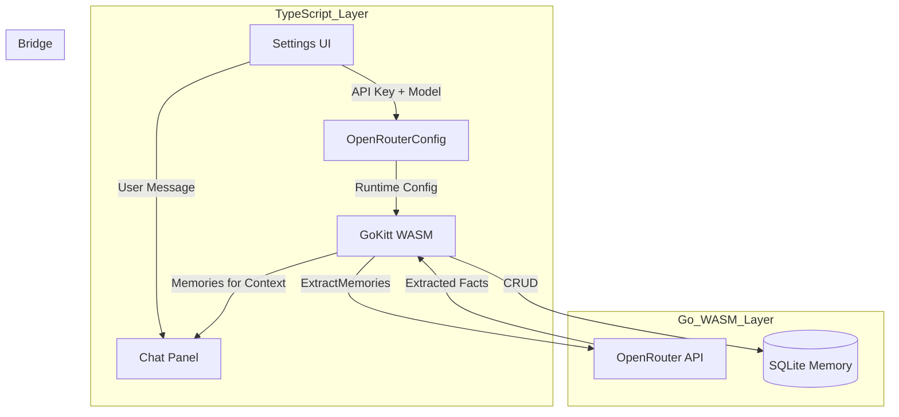

# Observational Memory Implementation Plan (Go + SQLite)

## Overview

Implement core observational memory for AI assistant conversations using:
- **SQLite** for persistence (extending existing GoKitt store)
- **go-openrouter** for LLM-based memory extraction
- **Thread-scoped** memory association

**Scope (Core Only):**
- ✅ Memory Storage (SQLite tables)
- ✅ Thread Association (conversation linkage)
- ✅ LLM Extraction (OpenRouter integration)
- ❌ Vector embeddings (future phase)
- ❌ Importance scoring (future phase)
- ❌ Memory consolidation (future phase)

---

## Existing Infrastructure Audit

### TypeScript OpenRouter Service (`src/app/lib/services/openrouter.service.ts`)

**Key findings:**
- Config stored in `localStorage` with key `openrouter:config`
- **Default model: `nvidia/nemotron-3-nano-30b-a3b:free`** (FREE tier!)
- Has `popularModels` list with free tier options
- Supports streaming, non-streaming, and tool calling

**Free tier models available:**
```typescript
popularModels = [
    { id: 'google/gemini-3-flash-preview', name: 'Gemini 3 Flash' },
    { id: 'nvidia/nemotron-3-nano-30b-a3b:free', name: 'Nemotron 3 Nano 30B' },
    { id: 'liquid/lfm-2.5-1.2b-thinking:free', name: 'LFM 2.5 Thinking' },
    { id: 'stepfun/step-3.5-flash:free', name: 'Step 3.5 Flash' },
    { id: 'tngtech/deepseek-r1t2-chimera:free', name: 'DeepSeek R1T2 Chimera' },
    { id: 'z-ai/glm-4.5-air:free', name: 'GLM 4.5 Air' },
]
```

### Usage Locations

| Location | Purpose |
|----------|---------|
| `ner.service.ts` | NER cleanup with LLM |
| `toolbar.component.ts` | AI button in toolbar |
| `ai-chat-panel.component.ts` | Chat UI with settings |
| `graph-tab.component.ts` | Graph tab LLM settings |

---

## Parallel Architecture Strategy

### What Stays in TypeScript
- **UI Components** - All settings panels, chat UI
- **Config Management** - localStorage, API key storage
- **Model Selection** - User picks from free tier list
- **Streaming Display** - Real-time response rendering

### What Moves to Go (WASM)
- **Memory Extraction** - LLM-based fact extraction
- **Memory Storage** - SQLite CRUD operations
- **Thread Management** - Conversation persistence
- **Context Assembly** - Building memory context for LLM

### Data Flow (Parallel Build)



---

## Configuration Protocol

### Go Extractor Receives Config at Runtime

**DO NOT hardcode models in Go!** The TypeScript settings UI controls everything.

```go
// WRONG - Hardcoded paid model
extractor := NewExtractor(ExtractorConfig{
    OpenRouterKey: "sk-or-...",
    Model: "anthropic/claude-3.5-sonnet", // ❌ PAID!
})

// CORRECT - Config from TypeScript
extractor := NewExtractor(ExtractorConfig{
    OpenRouterKey: tsConfig.apiKey,  // From UI
    Model: tsConfig.model,           // User-selected free model
})
```

### WASM Function Signature

```go
// Initialize extractor with runtime config from TS
func jsInitMemoryExtractor(this js.Value, args []js.Value) interface{} {
    apiKey := args[0].String()
    model := args[1].String()  // From settings UI
    
    extractor = memory.NewExtractor(memory.ExtractorConfig{
        Store:         store,
        OpenRouterKey: apiKey,
        Model:         model,
    })
    return true
}
```

---

## Implementation Status

### ✅ Phase 1: Data Layer (COMPLETE)
- [x] Add Go structs for Memory, Thread, ThreadMessage
- [x] Add memory schema to SQLite
- [x] Extend Storer interface with memory methods
- [x] Implement CRUD in sqlite_store.go

### ✅ Phase 2: LLM Integration (COMPLETE)
- [x] Add go-openrouter dependency to go.mod
- [x] Create OpenRouterClient wrapper
- [x] Implement extraction prompt and JSON parsing

### ✅ Phase 3: Extractor Service (COMPLETE)
- [x] Create Extractor struct and ProcessMessage flow
- [x] Add context retrieval and error handling

### ⏸️ Phase 4: WASM Bridge (PAUSED)
- Waiting for architecture review
- Must use runtime config from TypeScript
- No hardcoded models

### 🔜 Phase 5: Testing
- Unit tests for store
- Unit tests for extractor
- Integration test with real API (using free tier)

---

## Files Created/Modified

### New Go Files
| File | Status | Purpose |
|------|--------|---------|
| `GoKitt/pkg/memory/openrouter.go` | ✅ Complete | OpenRouter client wrapper |
| `GoKitt/pkg/memory/extractor.go` | ✅ Complete | Memory extraction service |

### Modified Go Files
| File | Status | Changes |
|------|--------|---------|
| `GoKitt/go.mod` | ✅ Complete | Added go-openrouter v1.1.5 |
| `GoKitt/internal/store/models.go` | ✅ Complete | Added Memory, Thread, ThreadMessage structs |
| `GoKitt/internal/store/sqlite_store.go` | ✅ Complete | Added memory CRUD methods + schema |

### TypeScript Files (No Changes Needed)
| File | Purpose |
|------|---------|
| `src/app/lib/services/openrouter.service.ts` | Existing - provides config |
| `src/app/components/right-sidebar/ai-chat-panel/ai-chat-panel.component.ts` | Existing - settings UI |

---

## Next Steps

1. **Fix Go default model** - Remove hardcoded `claude-3.5-sonnet`, use empty string or require config
2. **Add WASM bridge** - Functions to receive config from TypeScript
3. **Integration test** - Verify extraction works with free tier models
4. **Wire to chat** - Connect memory extraction to chat message flow

---

## Edge Cases

1. **Empty extractions** - LLM returns no memories
2. **Rate limiting** - OpenRouter API limits on free tier
3. **Large conversations** - Truncate context window
4. **Missing API key** - Graceful degradation when not configured
5. **Model unavailable** - Fallback to default free model
